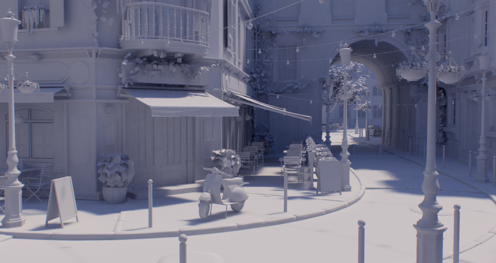

# toyrender

Personal project for playing with Vulkan raytracing. Also used as a school assignment.

## Features

- Path tracing with variable number of bounces
- Basic spatio-temporal denoising
- Basic shading model
- glTF (.glb) file support

## Set up

- `git clone`
- `cargo run`

Either add .glb file as a first parameter, or drag&drop.

## Prerequisites

- RT capable GPU
- Rust toolchain
- Vulkan SDK
- SDL2

## Controls

- W/A/S/D - movement
- Q/E - up/down
- H - toggle half-res effects
- R - flip through debug views
- T - toggle TAA accumulation
- \[ - remove PT bounce
- \] - add PT bounce