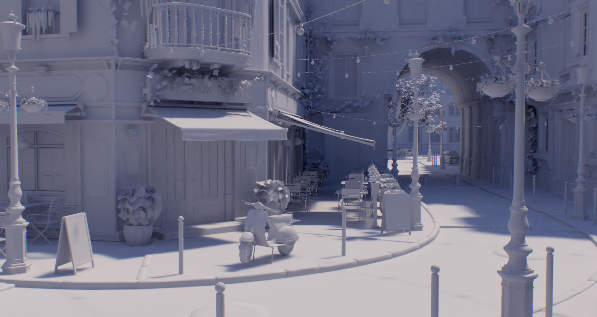

# toyrender

Personal project for playing with Vulkan raytracing.

## Features

- Two renderers - realtime-focused one and reference Monte-Carlo pathtracer
- `dear imgui` based settings
- glTF (.glb) file support
- resolution scaling
- placeable point lights
- AgX tonemapping
- Procedural or HDRI sky

### Reference renderer

- based on next event estimation
- infinite number of samples
- PBR shading with textures
- HDRI sky with importance sampling

### Real-time renderer

- hybrid raster and RT approach
- one path per pixel
- spatio-temporal denoising based
  on [SVGF](https://research.nvidia.com/publication/2017-07_spatiotemporal-variance-guided-filtering-real-time-reconstruction-path-traced)
- instanced rendering

## Missing features

- proper energy conserving BRDF
- alpha channel in shading (any-hit shaders)
- normal maps
- parity between renderers

### Next steps (more of a wishlist)

- handle emissive materials in the same way as other lights
- multiple importance sampling
- ReSTIR?
- swap out denoiser for custom implementation of ReBLUR?
- probe-based/screen-trace solution to speed up real-time renderer

## Set up

- `git clone`
- `cargo run`

Either add .glb file as a first parameter, or drag&drop.

Drag&drop sky hdr/exr texture for use as a HDRI sky.

## Prerequisites

- RT-capable GPU (tested only on AMD with Mesa driver)
- Rust toolchain
- Vulkan 1.3+
- SDL2

## Controls

- W/A/S/D - movement
- Q/E - up/down
- R - flip through debug views
- H - hide UI